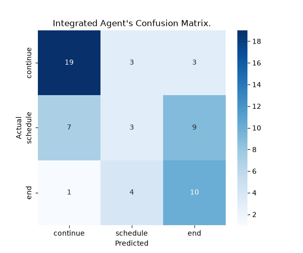
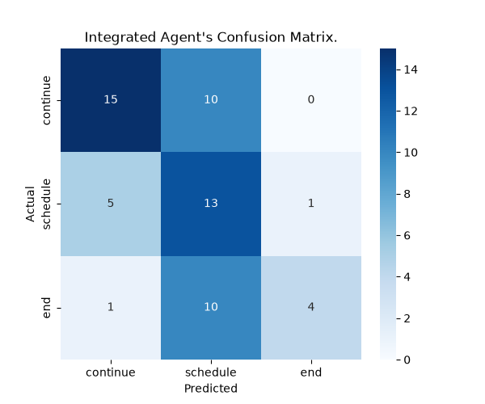

<!-- PROJECT LOGO -->
<p align="center">
  
</p>

<h1 align="center">AI Recruiter Assistant</h1>

<p align="center">
  A multi-agent AI system for candidate screening, job information RAG, and interview scheduling<br>
  <a href="#usage">View Demo</a>
  ·
  <a href="#getting-started">Report Bug</a>
  ·
  <a href="#features">Request Feature</a>
</p>

---
<br></br>

## Table of Contents

- [About The Project](#about-the-project)
- [Features](#features)
- [Getting Started](#getting-started)
- [Usage](#usage)
- [Screenshots](#screenshots)
- [Code Examples](#code-examples)
- [Project Structure](#project-structure)
- [To-Do List](#to-do-list)
- [Contact](#contact)
- [Acknowledgments](#acknowledgments)

---
<br></br>


## About The Project

> Multi-Agent AI system designed to automate candidate application screening, answer position queries via Retrieval-Augmented Generation (RAG), schedule technical interviews connected to SQL Server, and handle candidate exit flows.<br>

<div style="background: #272822; color: #f8f8f2; padding: 10px; border-radius: 8px;">
  <b> Technologies:</b> Python, LangChain, OpenAI GPT-4o, ChromaDB, SQL Server (pyodbc), Streamlit, Tiktoken, PyPDF
</div>

---
<br></br>


## Features

- [x] Multi-Agent Orchestration (Main Agent, Info Advisor, Schedule Advisor, Exit Advisor)  
- [x] RAG Job Description Vector Store with ChromaDB & OpenAI Embeddings  
- [x] Real-time SQL Server Interview Slot Availability & Booking  
- [x] Interactive Web UI built with Streamlit  
- [x] Command Line Interface (CLI) for terminal interaction  
- [x] Fine-tuned / specialized Advisor prompt management  
- [x] Robust fallback handling for agent iterations

---
<br></br>


##  Getting Started
Follow these steps to set up and run the AI Recruiter Assistant project on your local machine.

### Prerequisites

- Python >= 3.10
- SQL Server (Local instance, Docker, or Azure SQL Database)
- ODBC Driver 18 for SQL Server
- OpenAI API Key

### Installation

1. **Clone the repository:**
   ```bash
   git clone https://github.com/yourusername/FinalProject.git
   cd FinalProject
   ```

2. **Install dependencies:**
   ```bash
   pip install -r requirements.txt
   ```

3. **Configure Environment Variables:**
   Create a `.env` file in the project root with the following variables:
   ```env
   OPENAI_API_KEY=your_openai_api_key_here
   OPENAI_MODEL=gpt-4o-mini
   SQL_SERVER=localhost
   SQL_DATABASE=Tech
   SQL_TRUSTED_CONNECTION=yes
   SQL_DRIVER=ODBC Driver 18 for SQL Server # or 17, depending on your system.
   ```

4. **Initialize Database:**
   Execute `db_Tech.sql` against your SQL Server instance to create the `Tech` database and seed `dbo.Schedule`.

---
<br></br>


## Usage

### Run Streamlit Web Application

Run using the provided batch file:
```bash
start.bat
```
Or run directly with Streamlit:
```bash
python -m streamlit run streamlit_app/streamlit_main.py
```

### Run Terminal / CLI Mode

```bash
python -m app.main
```

### Rebuild Vector Store (RAG)

```bash
python -m app.modules.embedding --pdf "Python Developer Job Description.pdf"
```

---
<br></br>


## Screenshots

<p float="left">
  
  
</p>

---
<br></br>


## Code Examples

### Initializing and Interacting with the Main Agent

```python
from app.main import get_agent

# Build and wire the agent with tools
agent = get_agent(position="Python Dev", verbose=True)
session_id = "session_123"

# Opening greeting from bot
greeting = agent.step(session_id)
print("Bot:", greeting)

# User response
reply = agent.step(session_id, "I have 4 years of experience with Python and Django.")
print("Bot:", reply)
```

### Querying Job Description via RAG Tool

```python
from app.modules.embedding import build_search_job_description_tool

# Build vectorstore search tool
search_tool = build_search_job_description_tool()
result = search_tool.invoke({"query": "Is this a remote role?"})
print(result)
```

---
<br></br>


## Project Structure

```text
FinalProject/
├── agents_Instructions/
│   ├── exit_advisor.md
│   ├── info_advisor.md
│   ├── main_agent.md
│   └── schedule_advisor.md
├── app/
│   ├── __init__.py
│   ├── main.py
│   └── modules/
│       ├── __init__.py
│       ├── embedding.py
│       ├── agents/
│       │   ├── __init__.py
│       │   ├── agents.py
│       └── sql_interface/
│           ├── __init__.py
│           └── schedule_db.py
├── streamlit_app/
│   ├── __init__.py
│   ├── streamlit_main.py
│   └── utils.py
├── tests/
│   ├── sms_conversations.json
│   ├── test_evals.ipynb
│   ├── test_main.py
│   └── test_schedule_db.py
├── CFmatrix.png
├── CFmatrix2.png
├── db_Tech.sql
├── requirements.txt
├── start.bat
└── README.md
```

---
<br></br>


## To-Do List

- [x] Implement Multi-Agent architecture with Main Agent and Advisors
- [x] Set up ChromaDB vector database RAG system
- [x] Connect SQL Server database for live interview slot reservation
- [x] Develop Streamlit chat UI


---
<br></br>


## Contact

**Project Maintainers**:
Christian Haddad - [christian.na.haddad@gmail.com](mailto:christian.na.haddad@gmail.com)
Marian Awayed - [marianaawayed3@gmail.com](mailto:marianaawayed3@gmail.com)
Project Link: [https://github.com/Chris-Hd/FinalProject](https://github.com/Chris-Hd/FinalProject)

---
<br></br>


## Acknowledgments

- [Python](https://www.python.org/)
- [LangChain](https://www.langchain.com/)
- [OpenAI API](https://platform.openai.com/docs/overview)
- [ChromaDB](https://www.trychroma.com/)
- [Streamlit](https://streamlit.io/)
- [PyODBC](https://github.com/mkleehammer/pyodbc)


---
